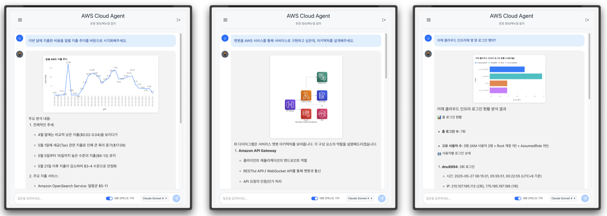
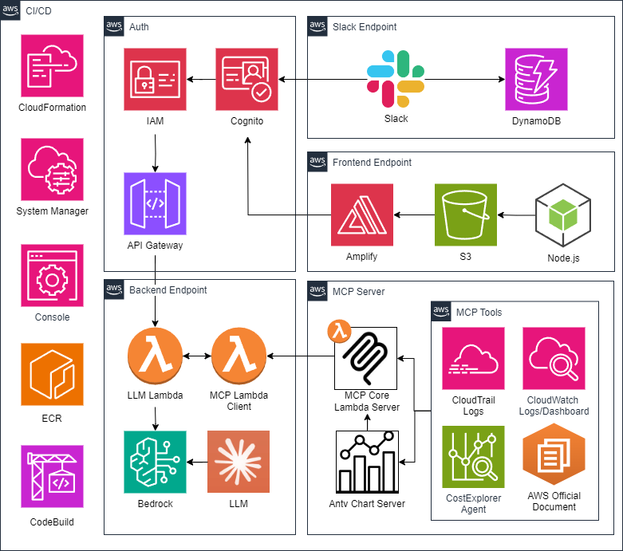

# WGA (WeGoAWS) - AWS 클라우드 운영 정보 챗봇 서비스



## 개요

WGA는 AWS 클라우드 운영 정보를 자연어로 질의응답할 수 있는 서버리스 기반의 AI 챗봇 서비스입니다. 사용자는 복잡한 AWS 콘솔을 직접 조작하는 대신, 간단한 자연어 질문을 통해 클라우드 자원 상태, 비용 분석, 보안 이벤트, 로그 분석 등의 정보를 즉시 얻을 수 있습니다.

### 핵심 가치
- **간편한 접근성**: 자연어 기반 질의로 AWS 전문 지식 없이도 클라우드 정보 조회 가능
- **정확한 답변**: AWS 공식 문서를 기반으로 정확한 답변 제공
- **실시간 모니터링**: CloudWatch 로그와 대시보드를 통한 실시간 시스템 상태 파악
- **비용 최적화**: AWS 비용 분석 및 최적화 제안
- **보안 강화**: 보안 이벤트 모니터링 및 알림

## 아키텍처

### 전체 시스템 아키텍처



### 기술 스택
- **Frontend**: React 18, TypeScript, Vite, Tailwind CSS
- **Backend**: AWS Lambda (Python 3.12), API Gateway
- **AI/ML**: Claude Sonnet 4, AWS Bedrock, MCP (Model Context Protocol)
- **Database**: DynamoDB
- **Storage**: S3 (정적 파일, 로그 저장)
- **Monitoring**: CloudWatch Log, CloudWatch Dashboard, Billing and Cost Management
- **Authentication**: AWS Cognito
- **Infrastructure**: CloudFormation, AWS CDK
- **CI/CD**: CodeBuild, Amplify

## 주요 기능

### 1. 자연어 기반 질의응답
- **로그 분석**: "어제 S3에 접근한 사용자는 누구인가요?"
- **비용 분석**: "지난 주 Opensearch 비용이 얼마나 나왔나요?"
- **보안 조회**: "최근 실패한 로그인 시도가 있나요?"
- **AWS 문서 검색**: "GuardDuty 심각도는 어떤 의미인가요?"

### 2. 실시간 모니터링 및 분석
- **CloudWatch 로그 분석**: 서비스별 로그 조회 및 분석
- **CloudWatch 대시보드 모니터링**: 주요 서비스를 실시간으로 모니터링
- **CloudTrail 이벤트**: AWS API 호출 이력 및 사용자 활동 추적
- **GuardDuty 보안 이벤트**: 보안 위협 분석
- **비용 분석**: 서비스별, 리전별, 일별 비용 분석

### 3. 시각화 및 차트 생성
- **동적 차트**: 막대 차트, 라인 차트, 파이 차트, 산점도 등
- **아키텍처 다이어그램**: AWS 인프라 시각화
- **플로우차트**: 프로세스 흐름도 생성
- **마인드맵**: 구조화된 정보 표현

### 4. AWS 공식 문서 기반 답변 제공
- **실시간 문서 검색**: AWS 공식 문서에서 키워드 기반 검색
- **컨텍스트 기반 추천**: 현재 질문과 관련된 문서 자동 추천
- **다국어 지원**: 영문 문서를 한국어로 자동 번역하여 제공

### 5. 다중 인터페이스 지원
- **웹 인터페이스**: React 기반 반응형 웹 앱
- **Slack 봇**: 슬랙 채널에서 직접 질의 가능

### 6. 대화 기록 관리
- **세션 관리**: 사용자별 대화 히스토리 저장
- **컨텍스트 유지**: 이전 대화 내용을 기반으로 한 연속 질의
- **히스토리 검색**: 과거 질의 및 답변 검색

### 7. 간편한 배포
- **원클릭 배포**: 단일 스크립트로 전체 인프라 배포
- **CloudFormation 기반**: AWS 네이티브 IaC로 안정적인 인프라 관리
- **자동화된 빌드**: CodeBuild를 통한 Docker 이미지 자동 빌드 및 배포
- **환경별 분리**: dev/test/prod 환경 독립 배포 및 관리

## 프로젝트 구조

```
WGA_production/
├─cloudformation
├─frontend
│ ├─public
│ └─src
│   ├─assets
│   ├─components
│   ├─directives
│   ├─layouts
│   ├─router
│   ├─stores
│   ├─types
│   ├─utils
│     └─views
├─images
├─layers
│  └─common
├─mcp
│  └─lambda_mcp
└─services
│   ├─chat-history
│   ├─db
│   ├─llm
│   └─slackbot
│
└── deploy.sh                
```

## 설치 및 배포

### 사전 요구사항
- AWS CLI 설정 및 적절한 권한
- Service Quotas -> API Gateway -> Maximum integration timeout in milliseconds -> 180000ms로 변경 요청(자동 승인)
- Node.js 18+ 
- Python 3.12+

### 환경 변수 설정
```bash
# AWS CLI 설정
aws configure
```

### 1단계: 기본 설정
```bash
# 프로젝트 클론
git clone https://github.com/WeGoAWS/WGA_production.git
cd WGA_production

# SSM 파라미터 설정 (필요한 경우)
aws ssm put-parameter --name "/wga/${Environment}/SlackbotToken" --value "your-slack-token" --type "SecureString"
aws ssm put-parameter --name "/wga/${Environment}/ANTHROPIC_API_KEY" --value "your-anthropic-key" --type "SecureString"
```

### 2단계: 통합 배포
```bash
# 개발 환경 배포
./deploy.sh dev

# 프로덕션 환경 배포
./deploy.sh prod
```

### 3단계: 배포 확인
배포 완료 후 다음 정보가 출력됩니다:
- **프론트엔드 URL**: `https://ENVIRONMENT.xxxxxxxxxxxxx.amplifyapp.com`
- **API Gateway URL**: `https://xxxxxxxxxx.execute-api.AWSREGION.amazonaws.com/ENVIRONMENT`
- **MCP Function URL**: `https://xxxxxxxxxx.lambda-url.AWSREGION.on.aws/`

추가로, SSM Parameter 정보도 제공됩니다.

## 설정 가이드

### Slack 봇 설정
1. Slack 앱 생성 및 봇 토큰 발급
2. SSM Parameter Store에 토큰 저장
3. Slack 앱에 다음 기능 추가:
   - Slash Commands: `/models`
   - Interactive Components
   - Bot Token Scopes: `chat:write`, `im:write`

## 사용 예시

### 웹 인터페이스
1. 브라우저에서 프론트엔드 URL 접속
2. Cognito를 통한 로그인
3. 채팅 인터페이스에서 자연어 질문 입력

### Slack 봇
```
# 모델 설정
/models

# 질의 실행
어제 EC2 인스턴스를 시작한 사용자는 누구인가요?
지난 주 S3 비용 분석해주세요
GuardDuty에서 감지된 보안 이벤트가 있나요?
```

## 핵심 구현 로직

### React 기반 실시간 채팅 시스템
React 18과 TypeScript를 활용하여 ChatGPT와 유사한 대화형 인터페이스를 구현했습니다. useState와 useEffect 훅을 통해 메시지 상태를 관리하고, 실시간으로 AI 응답을 스트리밍하는 것처럼 보이는 타이핑 애니메이션을 구현했습니다. 세션 기반 대화 히스토리를 지원하여 사용자가 이전 대화를 언제든 다시 확인할 수 있으며, 로컬 스토리지와 서버 동기화를 통해 데이터 일관성을 보장합니다. 마크다운 렌더링을 지원하여 코드 블록, 표, 링크 등을 올바르게 표시하고, 차트와 다이어그램은 이미지로 자동 렌더링됩니다.

### Cognito OAuth 2.0 통합 인증
AWS Cognito User Pool과 Identity Pool을 활용한 완전한 인증 시스템을 구현했습니다. OAuth 2.0 Authorization Code Flow를 통해 안전한 로그인을 제공하고, JWT 토큰 기반의 세션 관리를 구현했습니다. 사용자 정보는 Context API를 통해 전역 상태로 관리되며, 토큰 만료 시 자동 갱신 로직을 포함합니다. 프론트엔드에서는 protected route를 구현하여 인증되지 않은 사용자의 접근을 차단하고, 로그인 상태에 따라 다른 UI를 조건부 렌더링합니다.

### Lambda 기반 MCP 서버 및 클라이언트 구현
기존 MCP 프로토콜의 HTTP+SSE(Server-Sent Events) 방식은 AWS Lambda의 제약사항과 호환되지 않아, Streamable HTTP 방식으로 재설계했습니다. Lambda의 서버리스 환경에서 지속적인 연결을 유지할 수 없는 특성을 고려하여, 요청-응답 기반의 HTTP 프로토콜로 MCP 스펙을 구현했습니다. 이를 위해 전용 MCP 서버와 클라이언트를 직접 설계하고 개발했으며, 기존에 존재하는 MCP 서버들을 우리의 Streamable HTTP 방식과 호환되도록 리팩토링했습니다. 추가로, analyze_log_groups_insights 등 필요한 MCP 도구를 직접 설계하고 구현하였고, 기존의 MCP 도구 중 fetch_cloudwatch_logs_for_service()의 치명적인 결함을 발견 후 수정하였으며, 원작자의 Github Repo에 해당 내용을 반영한 Pull Request를 생성했습니다.

### Lambda 기반 서버리스 백엔드 아키텍처
전체 백엔드 시스템을 AWS Lambda 함수 기반으로 구현하여 서버리스 아키텍처의 장점을 극대화했습니다. 각 마이크로서비스를 독립적인 Lambda 함수로 분리하여 개발, 배포, 확장이 용이하도록 설계했습니다. LLM Service, Database Service, Chat History Service, Slackbot Service를 각각 별도의 Lambda 함수로 구현하고, API Gateway를 통해 통합된 RESTful API로 제공합니다. Lambda의 이벤트 기반 실행 모델을 활용하여 요청이 있을 때만 실행되므로 비용 효율성을 확보했으며, AWS의 관리형 서비스와의 네이티브 통합을 통해 운영 부담을 최소화했습니다. 특히 Lambda Layer를 활용하여 공통 라이브러리와 종속성을 효율적으로 관리하고, 콜드 스타트 최적화를 위해 함수별 메모리와 타임아웃을 세밀하게 조정했습니다.

### 세션 기반 컨텍스트 유지 시스템
이전 대화 내용을 활용한 연속적인 질의응답을 위해 DynamoDB 기반의 세션 관리 시스템을 구현했습니다. 각 사용자의 대화 히스토리를 Messages 배열 형태로 저장하고, 새로운 질의 시 이전 컨텍스트와 함께 AI 모델에 전달하여 더 정확한 답변을 생성합니다. 메모리 효율성을 위해 세션당 최대 메시지 수를 제한하고, 오래된 세션은 TTL을 통해 자동 삭제되도록 구현했습니다. 특히 MCP 클라이언트에서 process_user_input_with_history 메서드를 통해 히스토리 기반 처리와 일반 처리를 구분하여 성능을 최적화했습니다.

### API Gateway 통합 및 라우팅 시스템
모든 Lambda 함수들을 통합하는 단일 API Gateway를 구현하여 RESTful API 엔드포인트를 제공합니다. AWS_PROXY 통합 방식을 채택하여 Lambda 함수에서 HTTP 요청과 응답을 직접 처리할 수 있도록 했으며, 각 서비스별로 리소스를 분리하여 명확한 API 구조를 구성했습니다(/llm1, /llm2, /sessions, /execute-query, /create-table, /login, /callback, /models, /req 등). CORS 설정을 통해 프론트엔드와의 안전한 통신을 보장하고, OPTIONS 메서드를 지원하여 브라우저의 preflight 요청을 처리합니다. 환경별 스테이지(dev/test/prod) 배포를 통해 독립적인 API 엔드포인트를 관리하며, CloudFormation을 통한 자동화된 API 배포와 버전 관리를 구현했습니다. 특히 Slack 봇의 경우 서로 다른 인증 방식(OAuth, 슬래시 커맨드)에 대응하기 위해 라우팅별로 세밀한 권한 설정을 적용했습니다.

### CI/CD 파이프라인 구현
전체 시스템의 배포와 관리를 자동화하기 위해 CloudFormation 기반의 IaC(Infrastructure as Code)와 CodeBuild를 활용한 CI/CD 파이프라인을 구현했습니다. `deploy.sh` 스크립트를 통해 원클릭 배포가 가능하며, 환경별(dev/test/prod) 독립적인 스택 관리를 지원합니다. MCP 서버의 경우 Docker 컨테이너화하여 ECR에 저장하고, Lambda Container Image로 배포하는 방식을 채택했습니다. CloudFormation 스택의 의존성 관리를 통해 안전한 배포 순서를 보장하며, 배포 실패 시 자동 롤백 기능을 제공합니다.

## 기여 가이드

### 개발 환경 설정
```bash
# 개발 종속성 설치
cd frontend && npm install
cd ../services/llm && pip install -r requirements.txt

# 로컬 개발 서버 실행
cd frontend && npm run dev

# Lambda 함수 로컬 테스트
cd services/llm && python lambda_function.py
```

## FAQ

### Q: 어떤 AWS 서비스를 지원하나요?
A: 현재 CloudWatch, CloudTrail, GuardDuty, Cost Explorer, EC2, Lambda 등을 지원하며, 지속적으로 확장 중입니다.

### Q: 비용은 얼마나 발생하나요?
A: 사용량에 따라 다르지만, 일반적으로 월 $10-50 수준입니다.

### Q: 온프레미스에서도 사용할 수 있나요?
A: 현재는 AWS 클라우드 전용입니다.

### Q: 다른 AI 모델을 사용할 수 있나요?
A: 네, Anthropic이 제공하는 다양한 모델을 지원하며, 설정에서 변경 가능합니다.

## 지원 및 문의

- **GitHub Issues**: [프로젝트 이슈 페이지](https://github.com/WeGoAWS/WGA_production/issues)

## 라이선스

이 프로젝트는 MIT 라이선스 하에 배포됩니다. 자세한 내용은 [LICENSE](LICENSE) 파일을 참조하세요.
